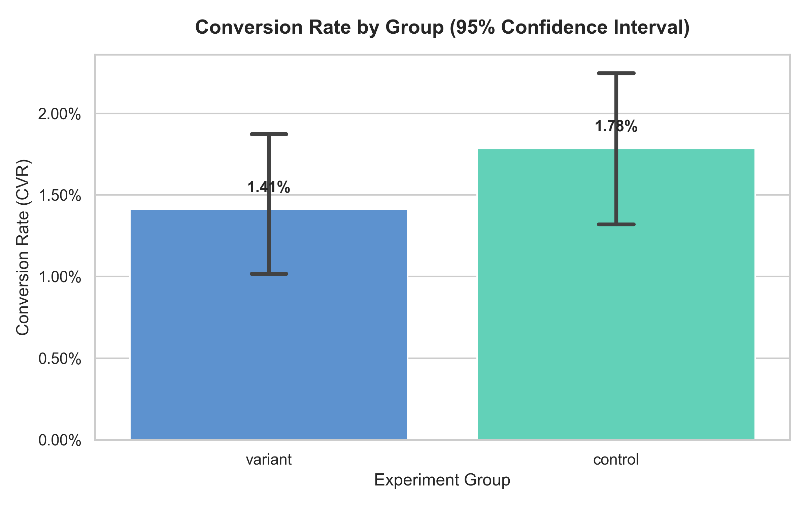
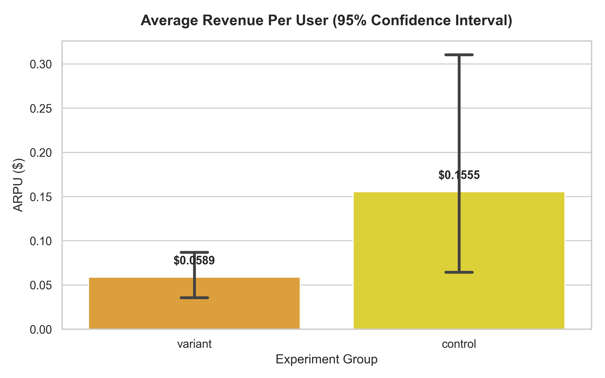

# 📊 A/B Testing Analysis: Feature Launch Evaluation

## 📖 Project Background
A company launched a new feature/landing page (Variant) and ran an A/B test against the old version (Control). The goal of this project is to analyze the test results using statistical rigor to determine if the new feature significantly improves **Conversion Rate (CVR)** and **Average Revenue Per User (ARPU)**, and to provide actionable business recommendations.

## 🛠️ Tech Stack
- **Python:** Data manipulation and analysis (`pandas`, `numpy`).
- **Statistical Testing:** Hypothesis testing (`scipy.stats`, `statsmodels`).
- **Data Visualization:** Confidence interval plotting (`matplotlib`, `seaborn`).

## 🧹 Step 1: Data Cleaning & Sanity Check
Before analyzing the metrics, a sanity check was performed to ensure the integrity of the split test. 
- Identified and removed users who were mistakenly exposed to **both** Control and Variant groups (Data logging errors).
- **Final Sample Size:** Control (2,390 users), Variant (2,393 users). The 50/50 split is balanced.

## 📈 Step 2: Key Findings & Statistical Significance

### 1. Conversion Rate (CVR)
- **Control:** 2.26% | **Variant:** 1.80%
- **Statistical Test:** Two-Proportion Z-Test
- **Result:** P-value = 0.2565 (> 0.05)
- **Conclusion:** The drop in conversion rate is **NOT statistically significant**. We cannot reject the null hypothesis.

### 2. Average Revenue Per User (ARPU)
- **Control:** $0.1969 | **Variant:** $0.0749
- **Statistical Test:** Welch's T-Test (Independent Samples, Unequal Variance)
- **Result:** P-value = 0.1605 (> 0.05)
- **Conclusion:** The difference in ARPU is **NOT statistically significant**.

*Note: The overlapping 95% Confidence Interval error bars in both charts visually confirm the lack of statistical significance.*

## 💡 Step 3: Business Recommendations
Based on the statistical analysis, I recommend the following:
1. **Do NOT Rollout:** The Variant group failed to show a significant improvement in either CVR or ARPU. Launching this feature would not yield a positive ROI and might carry unnecessary risk.
2. **Investigate the Drop:** Although not statistically significant, the absolute numbers dropped. Product managers should review the Variant design to ensure there are no UX frictions or bugs.
3. **Check Test Duration (Statistical Power):** Ensure the test ran for at least 1-2 full business cycles (e.g., 14 days) to rule out the "novelty effect" and ensure sufficient statistical power before officially closing the experiment.
